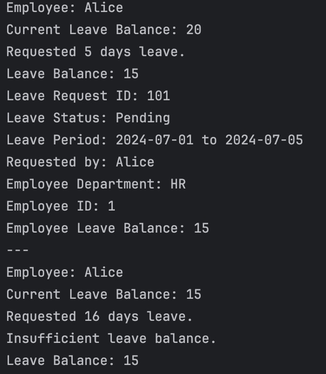

# Leave-Tracking-System

## Author
- Jeff Rolan G. Ynota

## Problem 1: Results

## Problem 2: Results and Explanation
- This Scenario is for Sick Leave
- I added validations for selections.

- Choose 2 to process a pending leave request

- Exit Message

- Additional I changed a feature in the Sick Leave Scenario where the user will see in real time if he/she can be approved. 
